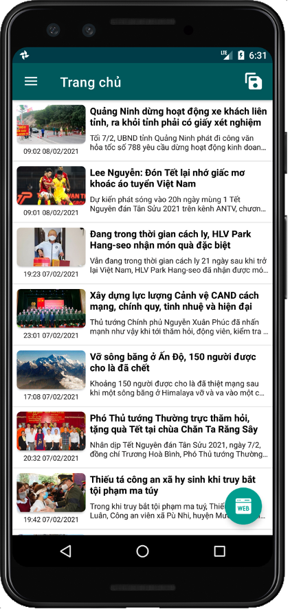
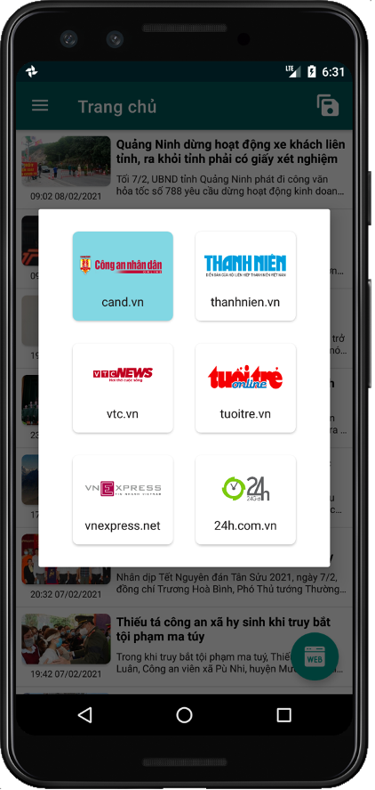
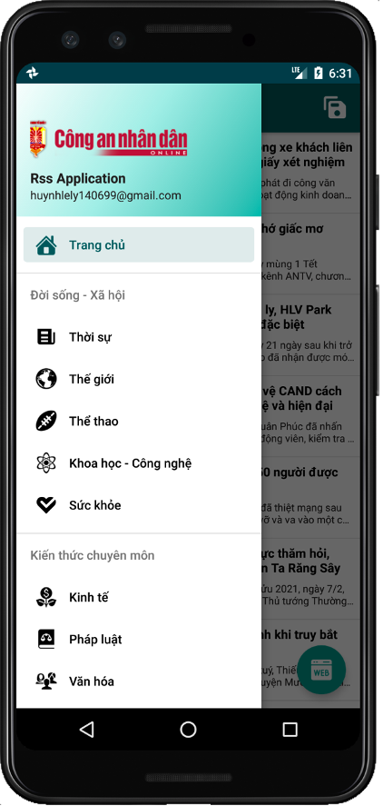
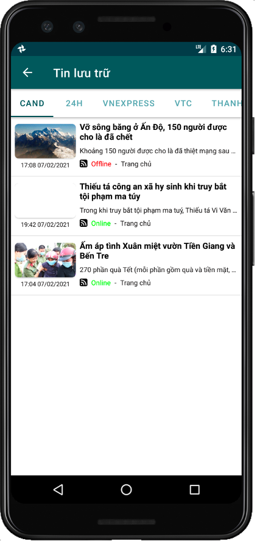

# Rss-application
 
Basic news app with Rss

## Features 
* View news from the site
* Save news for offline reading mode
* Bookmark your favorite news
* The interface changes according to the direction of rotation

## Screen Shot
|  |  |  | |
| - | - | - | - |

## Development team
* [Phuc Tran Ba](https://github.com/phuctranba)

## Development purpose
Personal projects
